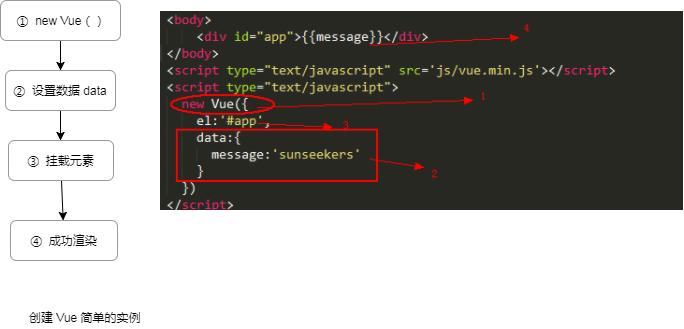

**思维导航**
<!-- TOC -->

- [1. Vue实例](#1-vue实例)
	- [1.1. vue实例的创建](#11-vue实例的创建)
	- [1.2. vue实例的属性](#12-vue实例的属性)
		- [computed](#computed)
	- [1.3. vue实例的接口方法](#13-vue实例的接口方法)

<!-- /TOC -->


# 1. Vue实例

## 1.1. vue实例的创建




## 1.2. vue实例的属性

* **el：挂载元素**
* **data：储存数据对象**
* **methods：储存方法函数**
* computed: 计算属性
* props： 组件接收到的props对象
* refs：引向子组件
* is：添加一个字符串模板


### computed

根据vue中的data数据做一些计算得到新的数据，可以实时更新，也可以像data一样用{{}}绑定展示。

``` html
<div id="app">
  <input type="text" v-model="value">
  <input type="button" value="发送" v-on:click="send"/>
  <div>value 的值是：{{ value }}</div>
  <!-- 引用 count -->
  <div>字数：{{ count }}</div>
</div>

<script>
var app = new Vue({
        el: '#app',
        data: function () {
            return {value: ''}
        },
        methods: {
            // 省略...
        },
        // 这是新增的计算属性
        computed: {
            count: function () {
                return this.value.length
            }
        }
	})
</script>
```


## 1.3. vue实例的接口方法

 var vm=new Vue（）

 这些属性都可以用 vm.$属性名 的方式访问到

 其中data中的元素还可以省略$data 直接用 vm.数据名 方式访问到

> vm.$属性名  vm.数据名

> $watch接口可以查看一个变量的改变，这个函数有两个参数，一个是监督的变量，另一个是一个回调函数，回调函数有newval，oldval这两个参数。

``` html js
<body>
<div id="app">
	{{a}}
</div>

<script type="text/javascript">
var data = { a : 1 };
var vm = new Vue({
	el   : "#app",
	data : data
});

data.a='hi....data....';
vm.$data===data//输出true
//理解点1：一个data是变量,一个是属性
// 将外部变量赋值给vm.$data，赋值后，vm.$data和外部data是绑定的，修改一方，另一方就会随之改变。

vm.data.a=2;
vm.$data.a=2;
// 理解点2：想要访问vm中的data需要使用vue的接口，vm.$data,直接使用vm.data是无效的

vm.$watch('a', function(newVal, oldVal){
	console.log(newVal, oldVal);
})
vm.$data.a = "test...."
//理解点3：注意要把这个函数放在变化之前
</script>

</body>
```


